# Alyuid

## Brief Description of the Project

Alyuid is a multilingual collection of small, focused web apps served from one Nuxt application. The root route is a searchable app directory, and every app shares the same navigation, visual system, responsive behavior, accessibility baseline, localization, and light/dark themes.

The available apps are:

| App                      | Route                       | Purpose                                                          | Screenshot                                                                                                            |
| ------------------------ | --------------------------- | ---------------------------------------------------------------- | --------------------------------------------------------------------------------------------------------------------- |
| Vocal Practice           | `/vocal`                    | Guided singing exercises with audio and visual practice tools    | 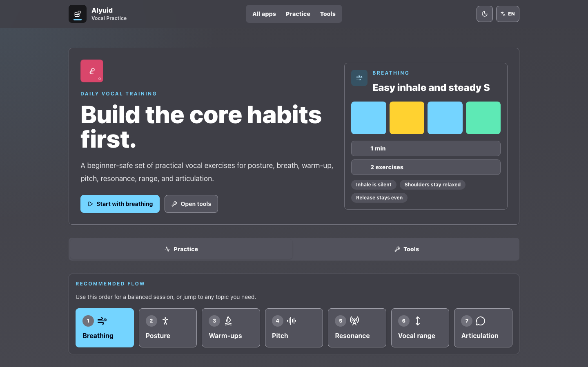                              |
| Spotify Playlist Printer | `/spotify-playlist-printer` | Fetch, format, copy, download, and print Spotify playlist tracks | 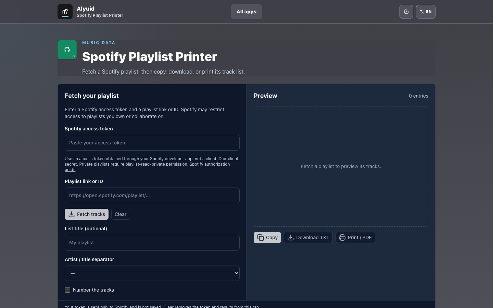 |
| E-Ink Feed               | `/e-ink-feed`               | Build and download a lightweight HTML directory of news links    | 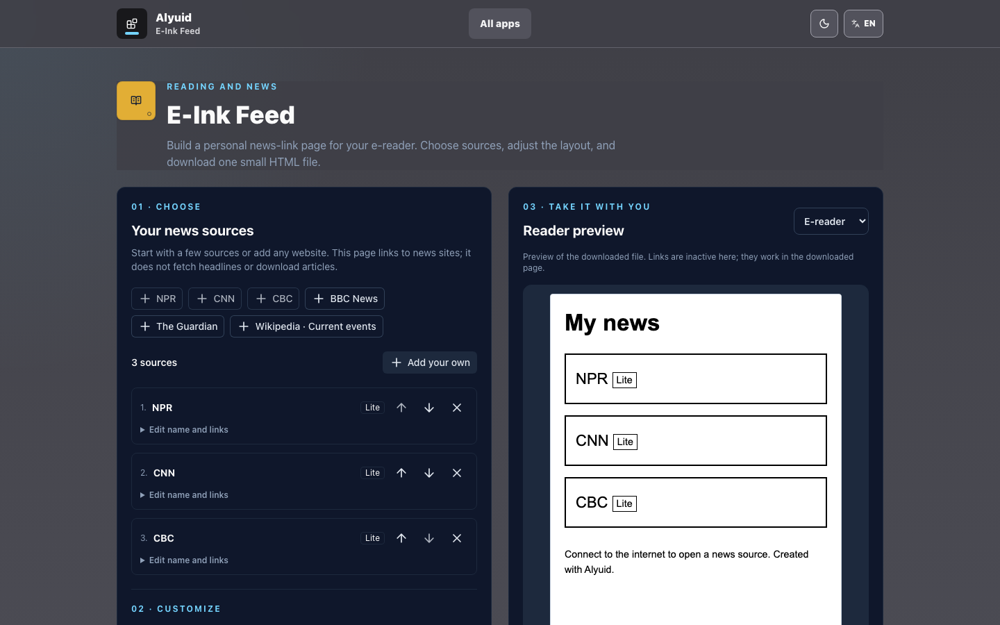                             |
| OPML Generator           | `/opml-generator`           | Create, import, validate, and download OPML subscription lists   | 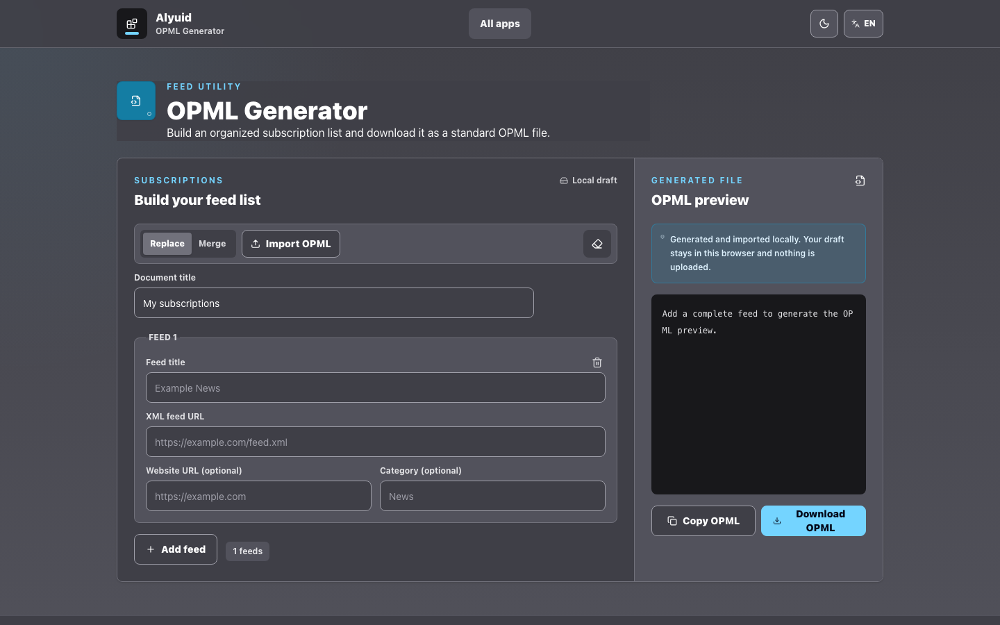                     |
| Line Sorter              | `/line-sorter`              | Sort and clean newline-separated text                            | 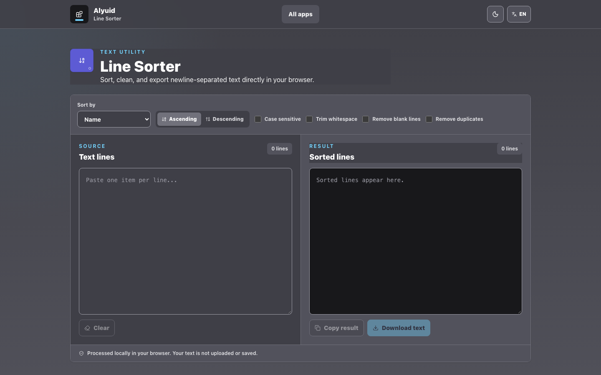                           |
| Table Viewer             | `/table-viewer`             | Parse, search, sort, and inspect CSV, TSV, and pasted tables     | 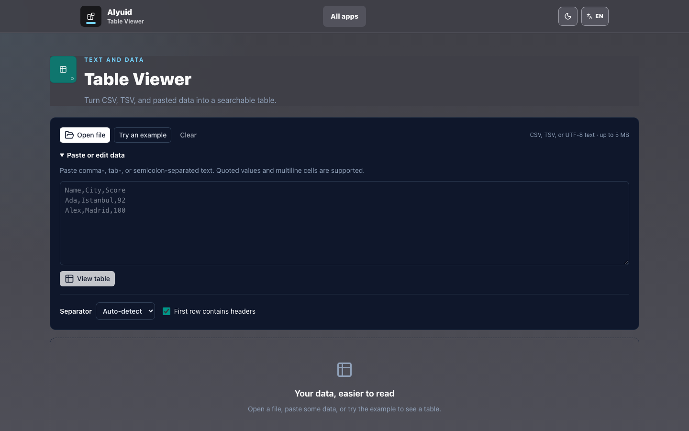                         |
| Pomodoro Timer           | `/pomodoro`                 | Run configurable focus and break cycles                          | 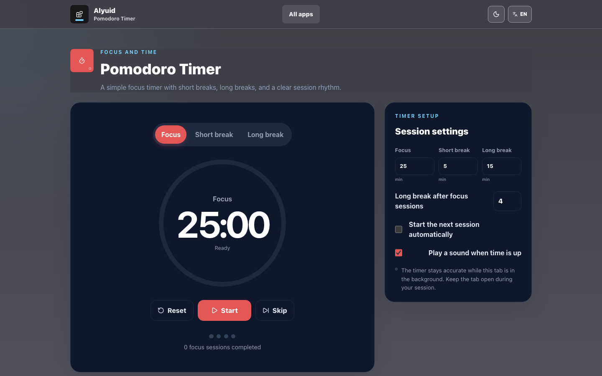                           |
| Color Toolkit            | `/color-toolkit`            | Convert colors, generate tonal palettes, and check contrast      | 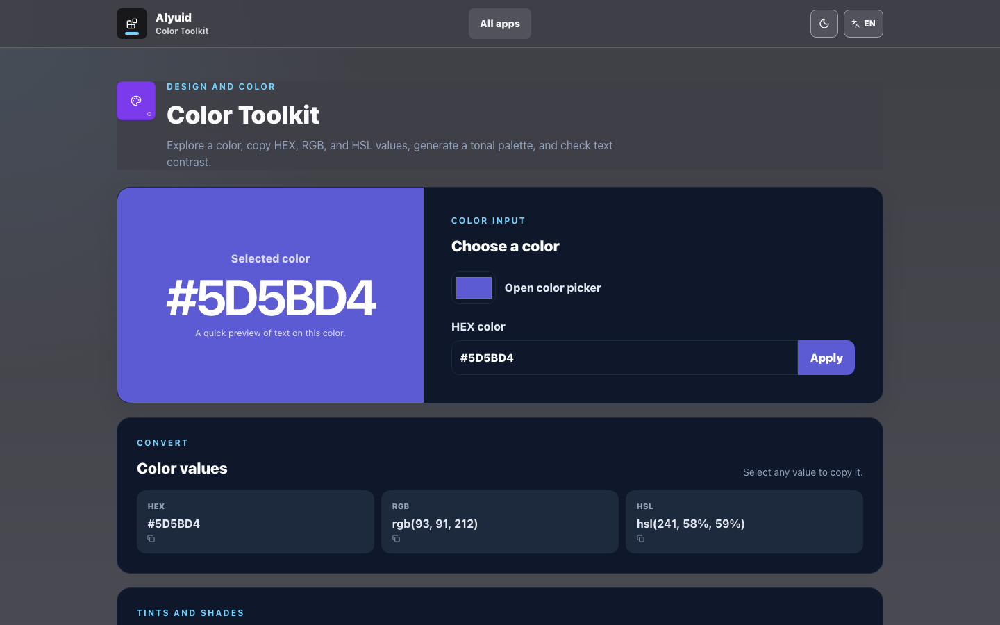                       |
| QR Code Generator        | `/qr-generator`             | Create customizable QR codes and download PNG or SVG files       | 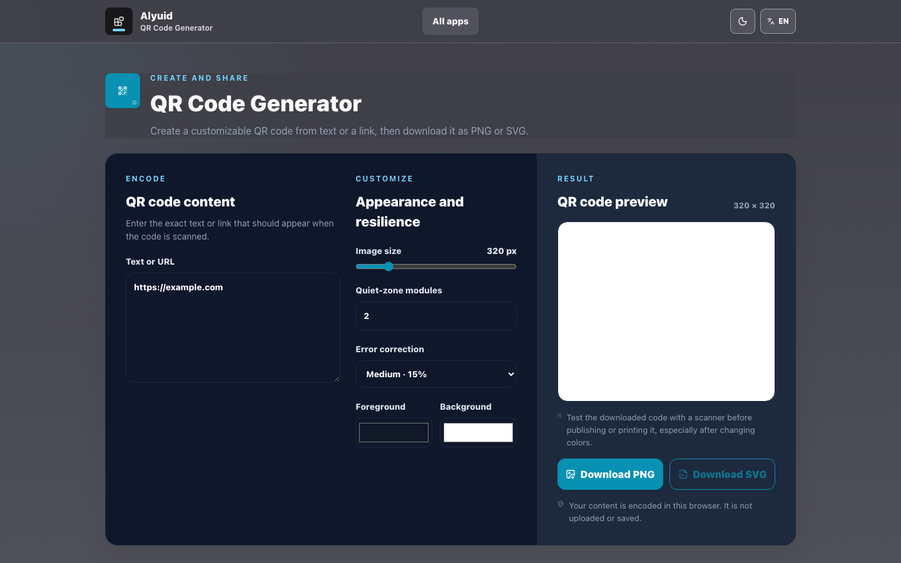                    |
| Date Passed Calculator   | `/date-calculator`          | Compare two dates in calendar units and exact totals             | 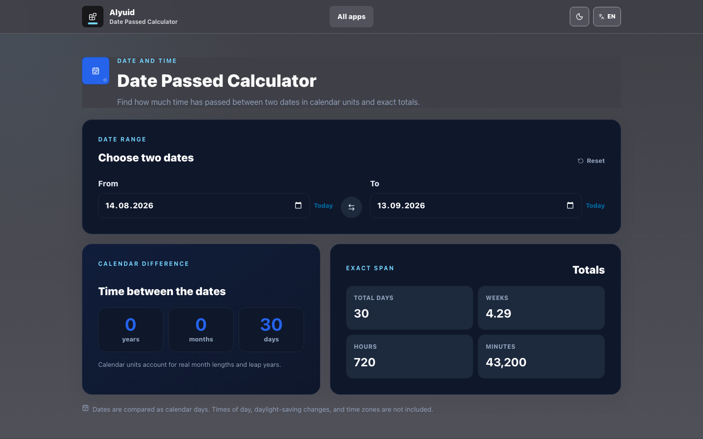            |
| Unit Converter           | `/unit-converter`           | Convert common measurement, speed, and digital storage units     | 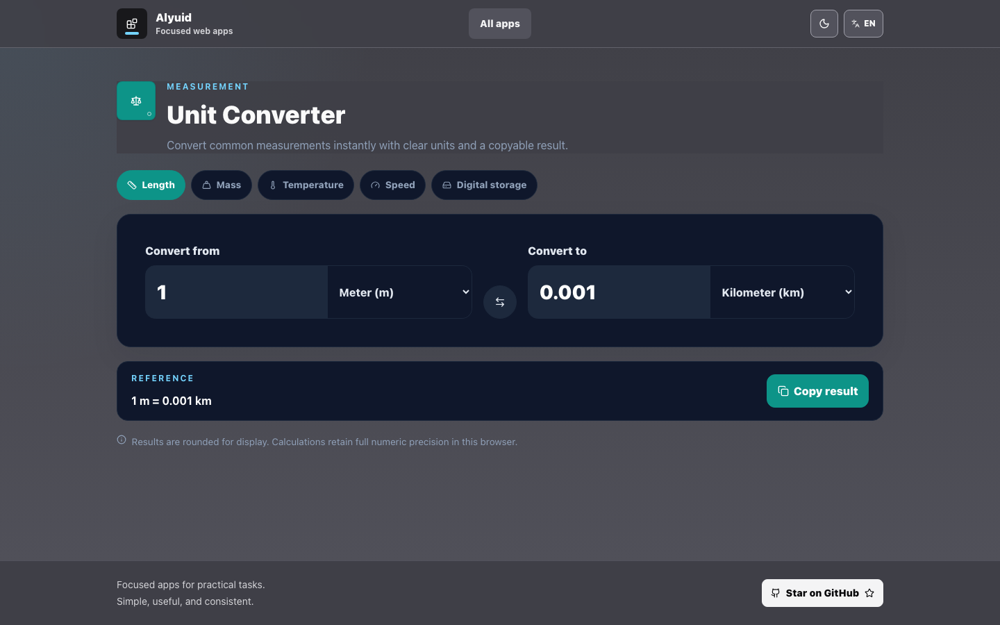                     |

Vocal Practice is the featured app, but it remains an independent feature within the wider Alyuid suite. Each app should solve one practical task quickly. The product should not grow into a general productivity platform, account system, social network, or collection of overlapping workflows.

Most processing happens locally in the browser. The Spotify app communicates directly with Spotify using a token supplied by the user; the other current utility apps do not require a backend. The interface and user-facing content support English, Spanish, and Turkish.

## Technology

- Nuxt 4 and Vue 3
- Nuxt Content for localized Vocal Practice content
- Nuxt i18n for localized routes and interface messages
- Nuxt UI and Tailwind CSS for shared UI and design tokens
- Nuxt SEO and Nuxt Icon
- Browser APIs for local files, downloads, clipboard access, audio, canvas rendering, printing, and local drafts

## Development

```bash
npm install
npm run dev
```

Use `npm run build` for production validation. Pure feature utilities use Node's built-in test runner:

```bash
node --test app/features/*/utils/*.test.js
```

## Repository Context

This repository treats documentation as part of the source of truth:

`Repository = Code + Context`

Read the context in this order before changing behavior:

`README → spec → architecture → agents → relevant code`

| File              | Purpose                                                       |
| ----------------- | ------------------------------------------------------------- |
| `README.md`       | Project overview, app inventory, technology, and entry points |
| `spec.md`         | Product behavior, requirements, boundaries, and privacy rules |
| `architecture.md` | Application structure, ownership boundaries, and data flows   |
| `agents.md`       | Working rules for AI coding assistants                        |
| `decisions.md`    | Accepted architectural and product decisions                  |

When implementation changes product behavior, architecture, or scope, update the relevant context document in the same change.
