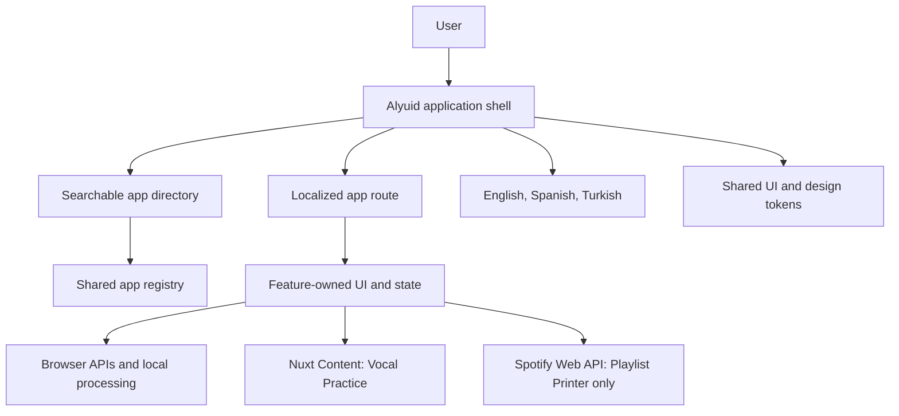

# Architecture

## Overview

Alyuid is a single Nuxt 4 application containing eleven independent web apps. A shared shell supplies navigation, branding, localization, theme behavior, accessibility conventions, and visual primitives. Route components coordinate each app; feature directories own domain behavior and state.

## Technology

- Nuxt 4 and Vue 3
- Nuxt Content
- Nuxt i18n
- Nuxt UI and Tailwind CSS
- Nuxt SEO and Nuxt Icon
- Papa Parse for delimited table input
- Browser Web Audio, MediaDevices, Clipboard, File, Blob, Print, and LocalStorage APIs

## Source Layout

- `app/pages/`: route-level components and SEO metadata
- `app/features/vocal/`: Vocal Practice workspace, components, and audio behavior
- `app/features/opml/`: OPML editor and XML utilities
- `app/features/line-sorter/`: line editor and pure sorting utility
- `app/features/spotify-playlist-printer/`: Spotify adapter, formatting, and print UI
- `app/features/e-ink-feed/`: source editor, local draft handling, HTML builder, and preview
- `app/features/table-viewer/`: parsing, filtering, sorting, pagination, and file input
- `app/features/pomodoro/`: focus timer and pure session-transition utility
- `app/features/color-toolkit/`: color conversion, palette, contrast utilities, and presentation
- `app/features/qr-generator/`: local QR rendering, export utilities, and presentation
- `app/features/date-calculator/`: date-only parsing, calendar difference utilities, and presentation
- `app/features/unit-converter/`: unit definitions, deterministic conversion utilities, and presentation
- `app/composables/useAppRegistry.js`: localized app identity, route, status, icon, and featured metadata
- `app/components/layouts/`: shared header and footer
- `app/components/ui/`: reusable controls and app-mark renderer
- `app/assets/css/main.css`: global tokens and shared/component presentation
- `content/`: localized Vocal Practice documents
- `i18n/locales/`: English, Spanish, and Turkish interface messages
- `public/`: static illustrations and public assets

## Routing and Rendering

The root page reads the reactive app registry, groups apps by availability, and filters localized metadata in the active locale. Available entries navigate through locale-aware routes. Vocal Practice carries a `featured` registry flag that affects directory presentation without changing route ownership.

Each app route imports one top-level feature component. Route files own page framing and SEO metadata; they should not contain domain algorithms.

Vocal Practice queries the localized root document from Nuxt Content with `useAsyncData`, then passes its metadata to the training workspace. The other current apps are driven by locale messages and feature-local state.

## Feature Data Flows

### Browser-local utilities

- OPML Generator parses and serializes XML with browser APIs and stores a versioned draft in LocalStorage.
- Line Sorter transforms in-memory text and exports through Clipboard and Blob APIs.
- E-Ink Feed validates and escapes source data, previews the generated HTML in an inert sandboxed iframe, downloads the same HTML string, and stores a versioned local draft.
- Table Viewer parses bounded input with Papa Parse, keeps cells as strings, and derives filtered, sorted, paginated row views without uploading or persisting the source.
- Pomodoro Timer stores state in memory, calculates from a wall-clock deadline, and synthesizes its optional completion sound locally.
- Color Toolkit parses and converts color values, creates tonal palettes, and calculates WCAG contrast entirely in memory.
- QR Code Generator uses the `qrcode` library to render content into a local canvas and generate self-contained SVG output. PNG export comes from the rendered canvas.
- Date Passed Calculator converts strict date-only input to UTC calendar values for deterministic differences while using the user's local date for Today shortcuts.
- Unit Converter normalizes values through category-specific base units, applying affine formulas for temperatures and fixed factors for other measurements.

### External integrations

Spotify Playlist Printer is the only current utility that sends user-provided data to an external API. It validates playlist identifiers, constructs every request on the fixed Spotify API origin, passes the token only in the authorization header, paginates with cancellation and timeout support, and commits results only after the complete playlist loads.

Vocal Practice requests microphone access only after user interaction. Pitch analysis stays in browser memory. External videos use official YouTube embeds or links and remain optional.

## Localization

Nuxt i18n uses English as the default locale with `prefix_except_default`; Spanish and Turkish routes are prefixed. Interface messages and Vocal Practice content must remain aligned across all three locales.

App names displayed by shared navigation or the directory should come from localized messages. Brand text comes from `site.name` and runtime site metadata.

## Boundaries

- Shared layout and UI code must stay free of app-specific domain logic.
- Feature code may depend on shared UI and Nuxt APIs but must not import another app's feature code.
- New apps require a registry entry, a dedicated route, a feature directory, localized messages, and corresponding context updates.
- Educational structure belongs in content when it benefits localization and authoring; interactive behavior belongs in Vue components or feature utilities.
- Pure parsing, transformation, validation, and transition rules should be isolated from components and tested directly.
- Browser-only APIs must run from client lifecycle or explicit user actions and must not break server rendering.

## Operational Constraints

- Keep one deployable Nuxt application while the suite remains small.
- Keep the root route as an app directory.
- Avoid accounts, shared persistence, cross-device state, social systems, and unrelated platform infrastructure without an explicit product and architecture decision.
- Existing LocalStorage keys containing `alyuid` remain unchanged so user drafts and theme preferences remain available.
